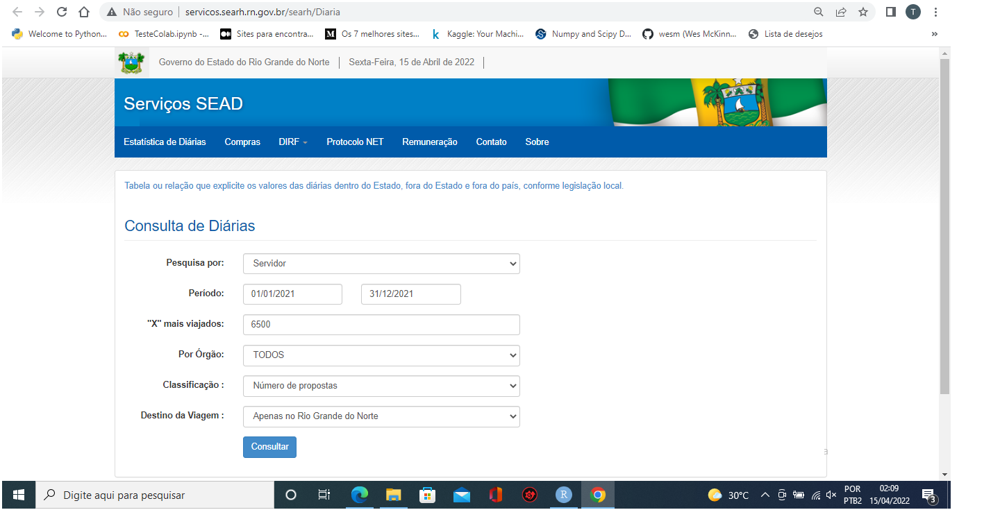
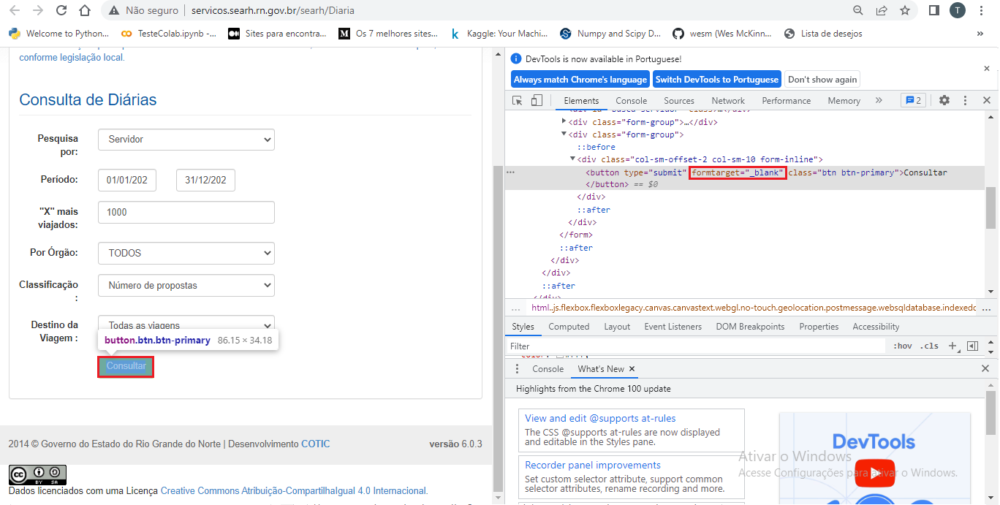
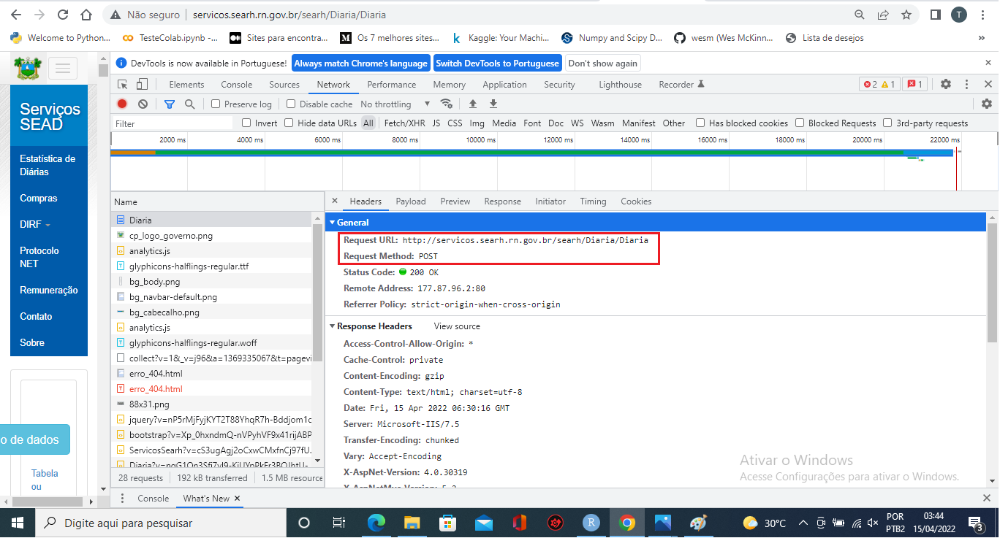
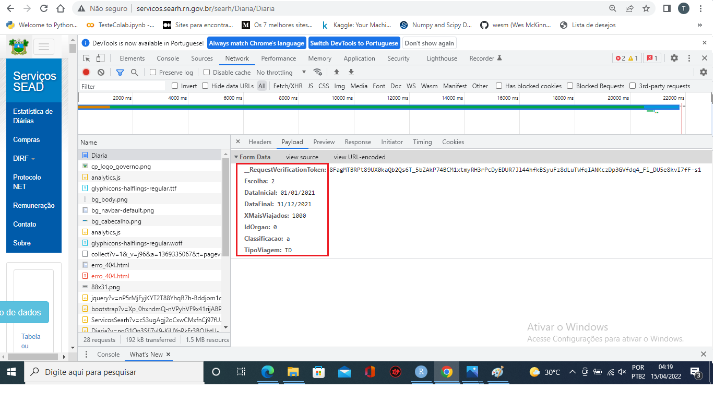

# Introdução

Nesse projeto será apresentado o trabalho final do curso de Web Scraping da [Curso-R](www.curso-r.com). A proposta foi construir uma ferramente que raspasse os dados do portal de serviços da secretaria de recursos humanos ([SEARH](http://servicos.searh.rn.gov.br/searh/)) do Estado do Rio Grande do Norte na parte dedicada as diárias pagas aos servidores devido às viagens a serviço.

# Objetivo

A ideia com a raspagem dos dados é ter acesso aos gastos públicos relativos as diárias pagas aos servidores em viagem à serviço pelo Estado do Rio Grande do Norte. A partir da obtenção desses dados, realizaremos uma análise de quais secretarias gastam mais com diárias, qual função ou cargo realizam mais viagens, em qual governo ocorreram mais viagens, entre outras coisas.

# Descrição da Página

Como se pode observar abaixo, no canto inferior direito da página de serviços da secretaria de recursos, há o link para o acesso da página onde se pode requisitar os dados das diárias dos servidores.


Na página que se abre aparece os campos para filtrar a requisição a ser feita. O primeiro é "Pesquisa por", onde se tem duas opções. Pode-se pesquisar por todos os órgãos ou por servidor. A segunda etapa da filtragem é o período, no qual colocamos a data inicial e dara final da pesquisa que se quer fazer. O terceiro campo se trata da quantidade de itens que serão mostrados na pesquisa. O quarto campo é para escolher o órgão de atuação, podendo ser escolhido todos ou individualmente. O quinto filtro é para classificar a ordem que os dados aparecerão e o último trata sobre o destino da viagem, sendo ela uma viagem interna (dentro do estado) ou externa.



Agora que sabemos qual página acessar e quais campos precisamos preencher para requisitar os dados, vamos continuar inspecionando a página.

A página com os resultados aparecem em uma nova aba do navegador. Devido a isso, para conseguir visualizar o tipo de requisição feita ao site, foi necessário ajustar o HTML da página (como mostrado no curso) em tempo real. Clicando com o botão direito do mouse em cima do botão de "Consultar", e escolhendo a opção inspecionar, encontramos que o botão possui um item em sua tag do tipo "formtarget=_blank", o que faz a página abrir em uma nova aba. Com a remoção desse item e gerando uma nova requisição, é possível ver de qual tipo ela era.



# URL requisitada e método de requisição

Com os ajustes feitos é possível visualizar a URL a qual se requisita as informações e o método de requisição feita. No nosso caso, se trata de uma requisição do tipo POST feita a URL http://servicos.searh.rn.gov.br/searh/Diaria/Diaria. Tanto a URL requisitada e o método de requisição estão indicados abaixo.



Como a requisição é do tipo POST se faz necessário visualizar quais os elementos fazem parte dessa requisição para que se possa imitá-la de forma mais efetiva. Abaixo temos esses elementos.


Acredito que para iniciar um fluxo de trabalho de web scraping para a proposta apresentada, essas são as principais informações que são necessárias. 

# Fluxo do trabalho

Após essa rápida apresentação do problema a ser soluicionado com o web scraping e o entendimento das infomações mais importantes que necesitamos para cria um fluxo de trabalho, será mostrado a partir de agora os recursos quwe foram criados para essa operação.

Em um primeiro momento precisamos transformar os elementos presentes na requisição do tipo POST em uma lista. Para tanto utilizaremos uma função presente no pacote `abjutils` chamada `chrome_to_body`.

```{r include=FALSE}

abjutils::chrome_to_body(
  "__RequestVerificationToken: AlJVY4p4ujrcH-pMuCAtC6qSTUurFj0hn_pPd0SDzBWFRxkE0TVr-8_fFhJArQ_WGYAQCrMfiyecAEV0DfnWKKuzSbc-uJ28vsHjgeDeyZE1
  Escolha: 2
  DataInicial: 01/01/2021
  DataFinal: 31/12/2021
  XMaisViajados: 500
  IdOrgao: 0
  Classificacao: a
  TipoViagem: TD"
)

```
Na sequência foi criada uma função que serve justamente para solicitar os dados das diárias dos servidores de forma anual, iniciando no dia 01 de Janeiro e finalizando no dia 31 de Dezembro de cada ano desejado.

```{r echo=TRUE}

diarias_desejadas <- function(ano) {

  body_rn <- list(
    "__RequestVerificationToken" = "AlJVY4p4ujrcH-pMuCAtC6qSTUurFj0hn_pPd0SDzBWFRxkE0TVr-8_fFhJArQ_WGYAQCrMfiyecAEV0DfnWKKuzSbc-uJ28vsHjgeDeyZE1",
    "Escolha" = "2",
    "DataInicial" = paste0("01/01/", ano),
    "DataFinal" = paste0("31/12/", ano),
    "XMaisViajados" = "6500",
    "IdOrgao" = "0",
    "Classificacao" = "b",
    "TipoViagem" = "RN")

  body_ou <- list(
    "__RequestVerificationToken" = "AlJVY4p4ujrcH-pMuCAtC6qSTUurFj0hn_pPd0SDzBWFRxkE0TVr-8_fFhJArQ_WGYAQCrMfiyecAEV0DfnWKKuzSbc-uJ28vsHjgeDeyZE1",
    "Escolha" = "2",
    "DataInicial" = paste0("01/01/", ano),
    "DataFinal" = paste0("31/12/", ano),
    "XMaisViajados" = "6500",
    "IdOrgao" = "0",
    "Classificacao" = "b",
    "TipoViagem" = "OU")

  u_diarias <- "http://servicos.searh.rn.gov.br/searh/Diaria/Diaria"

  r_diarias_rn <- httr::POST(u_diarias, body = body_rn)

  r_diarias_ou <- httr::POST(u_diarias, body = body_ou)

  if(r_diarias_rn$status_code == 200) {

    tabela_diarias_bruta_rn <- r_diarias_rn |>
      xml2::read_html() |>
      xml2::xml_find_all("//table//tr//td") |>
      xml2::xml_text() |>
      stringr::str_squish()

    tabela_diarias_modificada_rn <- tabela_diarias_bruta_rn |>
      c() |>
      matrix(ncol = 9, byrow = T) |>
      tibble::as_tibble() |>
      dplyr::select(-V4) |>
      dplyr::rename(
        ID = V1,
        CPF = V2,
        Nome = V3,
        Cargo_Funcao = V5,
        Orgao = V6,
        PCDs = V7,
        Diarias = V8,
        Valor = V9
      ) |>
      dplyr::mutate(
        Tipo_de_Viagem = "Interna",
        Ano = ano
      )

  } else {

    tabela_diarias_modificada_rn <- NULL

  }

  if(r_diarias_ou$status_code == 200) {

    tabela_diarias_bruta_ou <- r_diarias_ou |>
      xml2::read_html() |>
      xml2::xml_find_all("//table//tr//td") |>
      xml2::xml_text() |>
      stringr::str_squish()

    tabela_diarias_modificada_ou <- tabela_diarias_bruta_ou |>
      c() |>
      matrix(ncol = 9, byrow = T) |>
      tibble::as_tibble() |>
      dplyr::select(-V4) |>
      dplyr::rename(
        ID = V1,
        CPF = V2,
        Nome = V3,
        Cargo_Funcao = V5,
        Orgao = V6,
        PCDs = V7,
        Diarias = V8,
        Valor = V9
      ) |>
      dplyr::mutate(
        Tipo_de_Viagem = "Externa",
        Ano = ano
      )

  } else {

    tabela_diarias_modificada_ou <- NULL

  }

  dplyr::bind_rows(tabela_diarias_modificada_rn, tabela_diarias_modificada_ou)

}

```
Com a função concluída, podemos realizar iterações utilizando a função `map_dfr` do pacote `purrr`. A escolha da função `map_dfr` é para que os dados sejam unidos por linha, transformando todo o web scraping em um único data frame. Como visto anteriomente, a função criada possui um único argumento que é o ano em qual as diárias foram utilizadas, dessa forma para utilizar as iterações da função `map_dfr` será necessário criar um vetor com os anos desejado para consuta a partir do ano de 2004, pois antes disso não há informação disponível no portal.
*ALERTA: o chunk que faz a raspagem dos dados demora aproximadamente 20 minutos para ser executado. Por padrão deixarei o chunk desligado.*

```{r eval=FALSE, include=FALSE}

anos <- c(2004:2022)

diarias <- purrr::map_dfr(anos, diarias_desejadas)

diarias |>
  readr::write_rds("data/diarias")

```
Abaixo se encontra uma amostra de como ficaram os dados tabulados após a raspagem dos dados da página relativa as diárias recebidas pelos servidores do Estado do RN. Além dessas colunas criaremos pelo menos uma coluna a mais com o nome dos governadores que estavam eleitos para cada ano pesquisado na base.

```{r echo=FALSE}

diarias <- readr::read_rds("data/diarias")

diarias |>
  head() |>
  kableExtra::kbl() |> 
  kableExtra::kable_paper(bootstrap_options = "striped", full_width = F) |>
  kableExtra::kable_styling(bootstrap_options = c("striped", "hover")) 

```

Após salvar o material adiquirido a partir da raspagem dos dados em formato RDS, faremos as modificações necessárias para adapitá-lo as demandas que queremos responder. Essas alterações são apagar a coluna ID, pois não será necessário aos nossos trabalhos. A coluna `Nome` foi alterada as letras de maiusculas para o formato onde apenas a primeira letra é maiúscula e as outras minúsculas. Tornar os atributos `Cargo_Funcao`, `Orgao` e `Tipo_de_Viagem` do tipo fator `<fct>`. Transformar a coluna `PCDs` no tipo inteira, pois trata-se de valores numéricos discretos. Já a transformação necessária em `Diárias` é realizar a troca da virgula por ponto, pois a coluna será transformada para uma do tipo numéric `<dbl>`. O atributo `Valor` para transformá-lo também no tipo numérico é necessário a remoção da cifra que indica o tipo de moeda do valor recebido pelo servidor, então removemos "R$", elimina-mos o ponto e trocamos a vírgula por ponto, para assim conseguir realizar a transpfrmação para uma variável numérica `<dbl>`. E por último como já informado, será criada uma nova coluna com o nome dos governadores que estavam eleitos em cada ano das solicitações dos dados.

```{r echo=FALSE}

# diarias_modificada <- diarias

diarias_modificada <- readr::read_rds("data/diarias")

diarias_modificada <- diarias_modificada |>
  dplyr::mutate(
    ID = NULL,
    Nome = stringr::str_to_title(Nome),
    Cargo_Funcao = forcats::as_factor(Cargo_Funcao),
    Cargo_Funcao = forcats::fct_infreq(Cargo_Funcao),
    Orgao = forcats::as_factor(Orgao),
    Orgao = forcats::fct_infreq(Orgao),
    PCDs = as.integer(PCDs),
    Diarias = stringr::str_replace(Diarias, ",", "."),
    Diarias = as.numeric(Diarias),
    Valor = stringr::str_remove(Valor, "R\\$ "),
    Valor = stringr::str_remove(Valor, "\\."),
    Valor = stringr::str_replace(Valor, ",", "."),
    Valor = as.numeric(Valor),
    Tipo_de_Viagem = forcats::as_factor(Tipo_de_Viagem),
    Tipo_de_Viagem = forcats::fct_infreq(Tipo_de_Viagem),
    Governador = dplyr::case_when(
      Ano %in% c(2004:2010) ~ "Wilma de Faria",
      Ano %in% c(2011:2014) ~ "Rosalba Ciarlini",
      Ano %in% c(2015:2018) ~ "Robinson Faria",
      Ano %in% c(2019:2022) ~ "Fátima Bezerra"
    ),
    Valor_por_Diaria = Valor / Diarias
  )

diarias_modificada |>
  readr::write_rds("data/diarias_modificada")

diarias_modificada |>
  head()|>
  kableExtra::kbl() |> 
  kableExtra::kable_paper(bootstrap_options = "striped", full_width = F) |>
  kableExtra::kable_styling(bootstrap_options = c("striped", "hover"))

```
# Visualização dos dados

Com todas as alterações feitas, podemos verificar e analisar os dados a partir de visualizações. Primeiro vamos ver qual observação teve mais diárias acumuladas em um ano.

```{r echo=FALSE, fig.align='center', fig.height=6, fig.width=10, message=FALSE, warning=FALSE}

arrows <- tibble::tibble(
  x1 = c(3.95),
  x2 = c(4.19),
  y1 = c(390),
  y2 = c(316.5)
)


diarias_modificada |>
  ggplot2::ggplot() +
  ggplot2::aes(
    x = Governador,
    y = Diarias,
    color = Tipo_de_Viagem
  ) +
  ggplot2::geom_jitter(
    position = ggplot2::position_jitter(seed = 100, width = 0.25),
    size = 2,
    alpha = 0.3
  ) +
  ggplot2::theme_bw() +
  ggplot2::labs(
    title = "Como se comportaram as diárias durante os diferentes mandatos de governador?",
    subtitle = "Cada ponto mostra a quantidade de diárias recebidas por um servidor do Estado em viagens para dentro ou fora dos limites estaduais \nem um ano desde 2004 durante mandatos de governadores diferentes.",
    x = "Governador",
    y = "Número de Diárias"
  ) +
  ggplot2::scale_y_continuous(
    limits = c(0, 450)
  ) +
  ggplot2::scale_color_manual(
    values = c("#2A788EFF", "#FDE725FF")
  ) +
  ggplot2::theme(
    legend.position = "top",
    legend.title = ggplot2::element_blank(),
    axis.title.x = ggplot2::element_text(vjust = -1.5),
    axis.title.y = ggplot2::element_text(vjust = 2),
  ) +   
  ggplot2::annotate(
    "text", x = 3.75, y = 390, family = "Poppins", size = 2.8, color = "gray20",
    label = "306,5 diárias \nno ano de 2009"
  ) +
  ggplot2::geom_curve(
    data = arrows,
    ggplot2::aes(x = x1, y = y1, xend = x2, yend = y2),
    arrow = ggplot2::arrow(
      length = ggplot2::unit(0.08, "inch")
    ),
    size = 0.6,
    color = "gray20",
    curvature = -0.3
  )

```

Com o gráfico mostrado acima, conseguimos observar várias coisas. Uma delas, que foi destacada, é a que um servidor recebeu 306,5 diárias no ano de 2009, totalizando R$ 24.400,00 de recebidos. Também se pode observar que o mandato da governadora Wilma de Faria foi quando se teve mais diárias aprovadas, entretanto é importante lembrar que ela exerceu mandato do ano de 2003 a 2010, a única que se reelegeu durante o período em que os dados são disponibilizados. que no caso é desde o ano de 2004. Uma outra coisa que é bastante perceptível é que no mandato da governadora Rosalba Ciarlini houveram pouquíssimas viagens para fora do estado, viagens essas que são mostradas da cor amarela no gráfico.

```{r echo=FALSE, fig.align='center', message=FALSE, warning=FALSE, fig.height=6, fig.width=10,}

diarias_modificada |>
  dplyr::group_by(
    Ano,
    Orgao
  ) |>
  dplyr::summarise(
    Total_Valor = sum(Valor, na.rm = TRUE)
  ) |>
  dplyr::ungroup() |>
  ggplot2::ggplot() +
  ggplot2::geom_line(
    ggplot2::aes(
      x = Ano,
      y = Total_Valor,
      color = Orgao,
    ),
    size = 1
  ) +
  gghighlight::gghighlight(
    max(Total_Valor) >= 1500000,
    max_highlight = 10L,
    use_direct_label = FALSE,
    unhighlighted_params = list(size = 0.3, colour = "grey")
  ) +
  ggplot2::labs(
    title = "Gastos das insituições com diárias ao longo dos anos.",
    subtitle = "Cada linha representa os gastos das instituições do governo estadual. Estão destacadas as que em algum ano tiveram gastos \nmaiores a 1,5 milhões de reais com diárias para os servidores em viagem.",
    x = "Ano",
    y = "Total Gasto (milhões R$)"
  ) +
  ggplot2::scale_color_viridis_d() +
  ggplot2::theme_minimal() +
  ggplot2::theme(
    legend.position = "top",
    legend.title = ggplot2::element_blank(),
    axis.title.x = ggplot2::element_text(vjust = -1.5),
    axis.title.y = ggplot2::element_text(vjust = 2)
  ) + 
  ggplot2::scale_y_continuous(
    limits = c(0, 4000000),
    breaks = seq(0, 4000000, 1000000),
    labels = c("0", "1", "2", "3", "4")
  ) +
  ggplot2::scale_x_continuous(
    breaks = seq(2004, 2022, 3)
  )

```

Nesse segundo gráfico conseguimos ver o quanto as instituições governamentais gastaram por ano em diárias. As instituições destacadas são as que tiveram gasto de pelo menos 1,5 milhões de reais em algum ano desde que os dados começaram a ser disponibilizados. Consegue-se observar uma tendência de queda nos valores acumulados de diárias recebidas pelos servisores do estado ao longo dos anos. Possivelmente, com o advento do portal da transparência entre outras ferramentas que facilitaram o acesso a informação, tornou os procedimentos para o recebimento de diárias mais burocráticos e criteriosos, evitando desperdícios e corrupção. 

```{r echo=FALSE, fig.align='center',fig.height=6, fig.width=10, message=FALSE, warning=FALSE}

diarias_modificada |>
  dplyr::mutate(
    Valor_format = paste("R$", format(Valor, big.mark = ".", decimal.mark = ","))
  ) |>
  ggplot2::ggplot() +
  ggplot2::aes(x = Diarias, y = Valor) +
  ggplot2::geom_point() +
  gghighlight::gghighlight(
    Valor > 35000 & Diarias < 100,
    label_key = Valor_format
  ) +
  ggplot2::labs(
    title = "Há alguma incoerência nos valores pagos?",
    subtitle = "Alguns valores recebidos são extremamente altos quando se compara com a quantidade de diárias feitas para gerar esse valor. \nPodemos ver que alguns dos valores mais altos foram feitos a partir de menos de 100 diárias.",
    x = "Diárias",
    y = "Total Recebido (R$)"
  ) +
  ggplot2::theme_minimal() +
  ggplot2::theme(
    legend.position = "none",
    legend.title = ggplot2::element_blank(),
    axis.title.x = ggplot2::element_text(vjust = -1),
    axis.title.y = ggplot2::element_text(vjust = 1.5)
  ) +
  ggplot2::scale_y_continuous(
    limits = c(0, 120000),
    breaks = seq(0, 120000, 30000),
    labels = c("0", "30 mil", "60 mil", "90 mil", "120 mil")
  )

```

Nesse último gráfico observamos que alguns valores recebidos pelos servidores possuem poucas diárias acumuladas, gerando um pouco de incoerência com o restante das observações. Como exemplo no ano de 2017 o governador Robinson Faria acumulou 92 diárias totalizando aproximadamente 115 mil reais em valores recebidos. Pode existir diversas especulações para isso acontecer, a mais provável é que o valor da diária tenha relação com o cargo ou função exercida ou tenha relação o salário bruto do servidor. Nesse ano em específico o valor por diária recebida foi de R$ 1.250,00.

# Documentação da base final

A base final, após as modificações feitas possui os seguintes atributos: CPF, Nome, Cargo, Órgão, PCDs, Diárias, Valor, Tipo de Viagem, Ano e Governador. Abaixo segue os atributos com as respectivas descrições.

```{r echo=FALSE}

lista_atributos <- tibble::tibble(
  Nome_Atributo = c("CPF", "Nome", "Cargo_Funcao", "Orgao", "PCDs", "Diarias", "Valor", "Tipo_de_Viagem", "Ano", "Governador"),
  Descricao = c("CPF do servidor. Só mostra alguns dígitos para manter sigilo.", "Nome completo do servidor.", "Cargo ou função exercida pelo servidor.", "Órgão de lotação do servidor.", "Proposta de Concessão de Diária.", "Número de diárias concedidas ao servidor.", "Somatório das diárias concedidas ao servidor no período selecionado", "Tipo de viagem realizada pelo servidor, podendo ser do tipo interna quando é feita dentro do RN ou externa quando o servidor sai do estado.", "Ano no qual as informações foram coletadas.", "Governador eleito na época das informações coletadas.")
)

lista_atributos |>
  kableExtra::kbl() |> 
  kableExtra::kable_paper(bootstrap_options = "striped", full_width = F) |>
  kableExtra::kable_styling(bootstrap_options = c("striped", "hover"))

```
# Pontos de melhoria

Alguns pontos na raspagem de dados precisam ser melhorados. Os próximos passos serão em relação a melhorar a pesquisa conseguindo solicitar os dados diariamente dentro do ano solicitado, para assim conseguir construir uma série temporal com maior granularidade na variável tempo, e quem sabe trabalhar com modelos de machine learning para previsão de valores em datas futuras.
