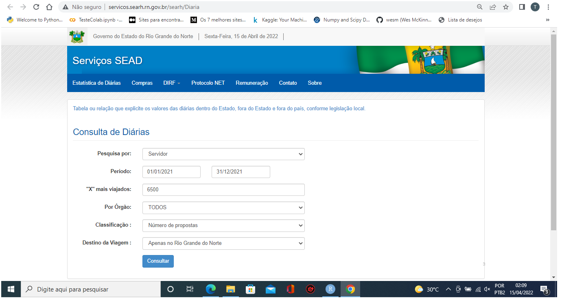

Atividade de Web Scraping
================

# Introdução

Nesse projeto será apresentado o trabalho final do curso de Web Scraping
da [Curso-R](www.curso-r.com). A proposta foi construir uma ferramente
que raspasse os dados do portal de serviços da secretaria de recursos
humanos ([SEARH](http://servicos.searh.rn.gov.br/searh/)) do Estado do
Rio Grande do Norte na parte dedicada as diárias pagas aos servidores
devido às viagens a serviço.

# Objetivo

A ideia com a raspagem dos dados é ter acesso aos gastos públicos
relativos as diárias pagas aos servidores em viagem à serviço pelo
Estado do Rio Grande do Norte. A partir da obtenção desses dados,
realizaremos uma análise de quais secretarias gastam mais com diárias,
qual função ou cargo realizam mais viagens, em qual governo ocorreram
mais viagens, entre outras coisas.

# Descrição da Página

Como se pode observar abaixo, no canto inferior direito da página de
serviços da secretaria de recursos, há o link para o acesso da página
onde se pode requisitar os dados das diárias dos servidores.


Na página que se abre aparece os campos para filtrar a requisição a ser
feita. O primeiro é “Pesquisa por”, onde se tem duas opções. Pode-se
pesquisar por todos os órgãos ou por servidor. A segunda etapa da
filtragem é o período, no qual colocamos a data inicial e dara final da
pesquisa que se quer fazer. O terceiro campo se trata da quantidade de
itens que serão mostrados na pesquisa. O quarto campo é para escolher o
órgão de atuação, podendo ser escolhido todos ou individualmente. O
quinto filtro é para classificar a ordem que os dados aparecerão e o
último trata sobre o destino da viagem, sendo ela uma viagem interna
(dentro do estado) ou externa.



Agora que sabemos qual página acessar e quais campos precisamos
preencher para requisitar os dados, vamos continuar inspecionando a
página.

A página com os resultados aparecem em uma nova aba do navegador. Devido
a isso, para conseguir visualizar o tipo de requisição feita ao site,
foi necessário ajustar o HTML da página (como mostrado no curso) em
tempo real. Clicando com o botão direito do mouse em cima do botão de
“Consultar”, e escolhendo a opção inspecionar, encontramos que o botão
possui um item em sua tag do tipo "formtarget=\_blank", o que faz a
página abrir em uma nova aba. Com a remoção desse item e gerando uma
nova requisição, é possível ver de qual tipo ela era.


# URL requisitada e método de requisição

Com os ajustes feitos é possível visualizar a URL a qual se requisita as
informações e o método de requisição feita. No nosso caso, se trata de
uma requisição do tipo POST feita a URL
<http://servicos.searh.rn.gov.br/searh/Diaria/Diaria>. Tanto a URL
requisitada e o método de requisição estão indicados abaixo.


Como a requisição é do tipo POST se faz necessário visualizar quais os
elementos fazem parte dessa requisição para que se possa imitá-la de
forma mais efetiva. Abaixo temos esses elementos.

 Acredito que para iniciar um fluxo de trabalho de
web scraping para a proposta apresentada, essas são as principais
informações que são necessárias.

# Fluxo do trabalho

Após essa rápida apresentação do problema a ser soluicionado com o web
scraping e o entendimento das infomações mais importantes que
necesitamos para cria um fluxo de trabalho, será mostrado a partir de
agora os recursos quwe foram criados para essa operação.

Em um primeiro momento precisamos transformar os elementos presentes na
requisição do tipo POST em uma lista. Para tanto utilizaremos uma função
presente no pacote `abjutils` chamada `chrome_to_body`.

Na sequência foi criada uma função que serve justamente para solicitar
os dados das diárias dos servidores de forma anual, iniciando no dia 01
de Janeiro e finalizando no dia 31 de Dezembro de cada ano desejado.

``` r
diarias_desejadas <- function(ano) {

  body_rn <- list(
    "__RequestVerificationToken" = "AlJVY4p4ujrcH-pMuCAtC6qSTUurFj0hn_pPd0SDzBWFRxkE0TVr-8_fFhJArQ_WGYAQCrMfiyecAEV0DfnWKKuzSbc-uJ28vsHjgeDeyZE1",
    "Escolha" = "2",
    "DataInicial" = paste0("01/01/", ano),
    "DataFinal" = paste0("31/12/", ano),
    "XMaisViajados" = "6500",
    "IdOrgao" = "0",
    "Classificacao" = "b",
    "TipoViagem" = "RN")

  body_ou <- list(
    "__RequestVerificationToken" = "AlJVY4p4ujrcH-pMuCAtC6qSTUurFj0hn_pPd0SDzBWFRxkE0TVr-8_fFhJArQ_WGYAQCrMfiyecAEV0DfnWKKuzSbc-uJ28vsHjgeDeyZE1",
    "Escolha" = "2",
    "DataInicial" = paste0("01/01/", ano),
    "DataFinal" = paste0("31/12/", ano),
    "XMaisViajados" = "6500",
    "IdOrgao" = "0",
    "Classificacao" = "b",
    "TipoViagem" = "OU")

  u_diarias <- "http://servicos.searh.rn.gov.br/searh/Diaria/Diaria"

  r_diarias_rn <- httr::POST(u_diarias, body = body_rn)

  r_diarias_ou <- httr::POST(u_diarias, body = body_ou)

  if(r_diarias_rn$status_code == 200) {

    tabela_diarias_bruta_rn <- r_diarias_rn |>
      xml2::read_html() |>
      xml2::xml_find_all("//table//tr//td") |>
      xml2::xml_text() |>
      stringr::str_squish()

    tabela_diarias_modificada_rn <- tabela_diarias_bruta_rn |>
      c() |>
      matrix(ncol = 9, byrow = T) |>
      tibble::as_tibble() |>
      dplyr::select(-V4) |>
      dplyr::rename(
        ID = V1,
        CPF = V2,
        Nome = V3,
        Cargo_Funcao = V5,
        Orgao = V6,
        PCDs = V7,
        Diarias = V8,
        Valor = V9
      ) |>
      dplyr::mutate(
        Tipo_de_Viagem = "Interna",
        Ano = ano
      )

  } else {

    tabela_diarias_modificada_rn <- NULL

  }

  if(r_diarias_ou$status_code == 200) {

    tabela_diarias_bruta_ou <- r_diarias_ou |>
      xml2::read_html() |>
      xml2::xml_find_all("//table//tr//td") |>
      xml2::xml_text() |>
      stringr::str_squish()

    tabela_diarias_modificada_ou <- tabela_diarias_bruta_ou |>
      c() |>
      matrix(ncol = 9, byrow = T) |>
      tibble::as_tibble() |>
      dplyr::select(-V4) |>
      dplyr::rename(
        ID = V1,
        CPF = V2,
        Nome = V3,
        Cargo_Funcao = V5,
        Orgao = V6,
        PCDs = V7,
        Diarias = V8,
        Valor = V9
      ) |>
      dplyr::mutate(
        Tipo_de_Viagem = "Externa",
        Ano = ano
      )

  } else {

    tabela_diarias_modificada_ou <- NULL

  }

  dplyr::bind_rows(tabela_diarias_modificada_rn, tabela_diarias_modificada_ou)

}
```

Com a função concluída, podemos realizar iterações utilizando a função
`map_dfr` do pacote `purrr`. A escolha da função `map_dfr` é para que os
dados sejam unidos por linha, transformando todo o web scraping em um
único data frame. Como visto anteriomente, a função criada possui um
único argumento que é o ano em qual as diárias foram utilizadas, dessa
forma para utilizar as iterações da função `map_dfr` será necessário
criar um vetor com os anos desejado para consuta a partir do ano de
2004, pois antes disso não há informação disponível no portal. *ALERTA:
o chunk que faz a raspagem dos dados demora aproximadamente 20 minutos
para ser executado. Por padrão deixarei o chunk desligado.*

Abaixo se encontra uma amostra de como ficaram os dados tabulados após a
raspagem dos dados da página relativa as diárias recebidas pelos
servidores do Estado do RN. Além dessas colunas criaremos pelo menos uma
coluna a mais com o nome dos governadores que estavam eleitos para cada
ano pesquisado na base.

<table class=" lightable-paper table table-striped table-hover" style="font-family: &quot;Arial Narrow&quot;, arial, helvetica, sans-serif; width: auto !important; margin-left: auto; margin-right: auto; margin-left: auto; margin-right: auto;">
<thead>
<tr>
<th style="text-align:left;">
ID
</th>
<th style="text-align:left;">
CPF
</th>
<th style="text-align:left;">
Nome
</th>
<th style="text-align:left;">
Cargo\_Funcao
</th>
<th style="text-align:left;">
Orgao
</th>
<th style="text-align:left;">
PCDs
</th>
<th style="text-align:left;">
Diarias
</th>
<th style="text-align:left;">
Valor
</th>
<th style="text-align:left;">
Tipo\_de\_Viagem
</th>
<th style="text-align:right;">
Ano
</th>
</tr>
</thead>
<tbody>
<tr>
<td style="text-align:left;">
1
</td>
<td style="text-align:left;">
\***.791.564.**
</td>
<td style="text-align:left;">
MARCONDE FERNANDES DO NASCIMENTO
</td>
<td style="text-align:left;">
Cabos e Soldados
</td>
<td style="text-align:left;">
SET
</td>
<td style="text-align:left;">
11
</td>
<td style="text-align:left;">
201,5
</td>
<td style="text-align:left;">
R$ 6.045,00
</td>
<td style="text-align:left;">
Interna
</td>
<td style="text-align:right;">
2004
</td>
</tr>
<tr>
<td style="text-align:left;">
2
</td>
<td style="text-align:left;">
\***.449.864.**
</td>
<td style="text-align:left;">
SEBASTIÃO ALIPIO DE MACEDO
</td>
<td style="text-align:left;">
Cargos e Empregos de Nivel Médio e demais Servidores de apoio do Quadro
Geral de Pessoal do Estado
</td>
<td style="text-align:left;">
SEMARH
</td>
<td style="text-align:left;">
12
</td>
<td style="text-align:left;">
201
</td>
<td style="text-align:left;">
R$ 9.531,50
</td>
<td style="text-align:left;">
Interna
</td>
<td style="text-align:right;">
2004
</td>
</tr>
<tr>
<td style="text-align:left;">
3
</td>
<td style="text-align:left;">
\***.432.064.**
</td>
<td style="text-align:left;">
JOÃO BOSCO ALVES DA SILVA
</td>
<td style="text-align:left;">
Cargos e Empregos de Nivel Médio e demais Servidores de apoio do Quadro
Geral de Pessoal do Estado
</td>
<td style="text-align:left;">
SEMARH
</td>
<td style="text-align:left;">
12
</td>
<td style="text-align:left;">
201
</td>
<td style="text-align:left;">
R$ 9.531,50
</td>
<td style="text-align:left;">
Interna
</td>
<td style="text-align:right;">
2004
</td>
</tr>
<tr>
<td style="text-align:left;">
4
</td>
<td style="text-align:left;">
\***.569.294.**
</td>
<td style="text-align:left;">
BALTAZAR FRANCISCO DE LIMA
</td>
<td style="text-align:left;">
Cargos e Empregos de Nivel Médio e demais Servidores de apoio do Quadro
Geral de Pessoal do Estado
</td>
<td style="text-align:left;">
SEMARH
</td>
<td style="text-align:left;">
13
</td>
<td style="text-align:left;">
200,5
</td>
<td style="text-align:left;">
R$ 9.256,50
</td>
<td style="text-align:left;">
Interna
</td>
<td style="text-align:right;">
2004
</td>
</tr>
<tr>
<td style="text-align:left;">
5
</td>
<td style="text-align:left;">
\***.550.204.**
</td>
<td style="text-align:left;">
FRANCISCO FERREIRA DE SOUZA
</td>
<td style="text-align:left;">
Cargos e Empregos de Nivel Médio e demais Servidores de apoio do Quadro
Geral de Pessoal do Estado
</td>
<td style="text-align:left;">
SEMARH
</td>
<td style="text-align:left;">
10
</td>
<td style="text-align:left;">
193
</td>
<td style="text-align:left;">
R$ 11.126,50
</td>
<td style="text-align:left;">
Interna
</td>
<td style="text-align:right;">
2004
</td>
</tr>
<tr>
<td style="text-align:left;">
6
</td>
<td style="text-align:left;">
\***.878.224.**
</td>
<td style="text-align:left;">
COSMO FERREIRA DA SILVA
</td>
<td style="text-align:left;">
Cargos e Empregos de Nivel Médio e demais Servidores de apoio do Quadro
Geral de Pessoal do Estado
</td>
<td style="text-align:left;">
SEMARH
</td>
<td style="text-align:left;">
9
</td>
<td style="text-align:left;">
192,5
</td>
<td style="text-align:left;">
R$ 7.015,00
</td>
<td style="text-align:left;">
Interna
</td>
<td style="text-align:right;">
2004
</td>
</tr>
</tbody>
</table>

Após salvar o material adiquirido a partir da raspagem dos dados em
formato RDS, faremos as modificações necessárias para adapitá-lo as
demandas que queremos responder. Essas alterações são apagar a coluna
ID, pois não será necessário aos nossos trabalhos. A coluna `Nome` foi
alterada as letras de maiusculas para o formato onde apenas a primeira
letra é maiúscula e as outras minúsculas. Tornar os atributos
`Cargo_Funcao`, `Orgao` e `Tipo_de_Viagem` do tipo fator `<fct>`.
Transformar a coluna `PCDs` no tipo inteira, pois trata-se de valores
numéricos discretos. Já a transformação necessária em `Diárias` é
realizar a troca da virgula por ponto, pois a coluna será transformada
para uma do tipo numéric `<dbl>`. O atributo `Valor` para transformá-lo
também no tipo numérico é necessário a remoção da cifra que indica o
tipo de moeda do valor recebido pelo servidor, então removemos “R$”,
elimina-mos o ponto e trocamos a vírgula por ponto, para assim conseguir
realizar a transpfrmação para uma variável numérica `<dbl>`. E por
último como já informado, será criada uma nova coluna com o nome dos
governadores que estavam eleitos em cada ano das solicitações dos dados.

<table class=" lightable-paper table table-striped table-hover" style="font-family: &quot;Arial Narrow&quot;, arial, helvetica, sans-serif; width: auto !important; margin-left: auto; margin-right: auto; margin-left: auto; margin-right: auto;">
<thead>
<tr>
<th style="text-align:left;">
CPF
</th>
<th style="text-align:left;">
Nome
</th>
<th style="text-align:left;">
Cargo\_Funcao
</th>
<th style="text-align:left;">
Orgao
</th>
<th style="text-align:right;">
PCDs
</th>
<th style="text-align:right;">
Diarias
</th>
<th style="text-align:right;">
Valor
</th>
<th style="text-align:left;">
Tipo\_de\_Viagem
</th>
<th style="text-align:right;">
Ano
</th>
<th style="text-align:left;">
Governador
</th>
<th style="text-align:right;">
Valor\_por\_Diaria
</th>
</tr>
</thead>
<tbody>
<tr>
<td style="text-align:left;">
\***.791.564.**
</td>
<td style="text-align:left;">
Marconde Fernandes Do Nascimento
</td>
<td style="text-align:left;">
Cabos e Soldados
</td>
<td style="text-align:left;">
SET
</td>
<td style="text-align:right;">
11
</td>
<td style="text-align:right;">
201.5
</td>
<td style="text-align:right;">
6045.0
</td>
<td style="text-align:left;">
Interna
</td>
<td style="text-align:right;">
2004
</td>
<td style="text-align:left;">
Wilma de Faria
</td>
<td style="text-align:right;">
30.00000
</td>
</tr>
<tr>
<td style="text-align:left;">
\***.449.864.**
</td>
<td style="text-align:left;">
Sebastião Alipio De Macedo
</td>
<td style="text-align:left;">
Cargos e Empregos de Nivel Médio e demais Servidores de apoio do Quadro
Geral de Pessoal do Estado
</td>
<td style="text-align:left;">
SEMARH
</td>
<td style="text-align:right;">
12
</td>
<td style="text-align:right;">
201.0
</td>
<td style="text-align:right;">
9531.5
</td>
<td style="text-align:left;">
Interna
</td>
<td style="text-align:right;">
2004
</td>
<td style="text-align:left;">
Wilma de Faria
</td>
<td style="text-align:right;">
47.42040
</td>
</tr>
<tr>
<td style="text-align:left;">
\***.432.064.**
</td>
<td style="text-align:left;">
João Bosco Alves Da Silva
</td>
<td style="text-align:left;">
Cargos e Empregos de Nivel Médio e demais Servidores de apoio do Quadro
Geral de Pessoal do Estado
</td>
<td style="text-align:left;">
SEMARH
</td>
<td style="text-align:right;">
12
</td>
<td style="text-align:right;">
201.0
</td>
<td style="text-align:right;">
9531.5
</td>
<td style="text-align:left;">
Interna
</td>
<td style="text-align:right;">
2004
</td>
<td style="text-align:left;">
Wilma de Faria
</td>
<td style="text-align:right;">
47.42040
</td>
</tr>
<tr>
<td style="text-align:left;">
\***.569.294.**
</td>
<td style="text-align:left;">
Baltazar Francisco De Lima
</td>
<td style="text-align:left;">
Cargos e Empregos de Nivel Médio e demais Servidores de apoio do Quadro
Geral de Pessoal do Estado
</td>
<td style="text-align:left;">
SEMARH
</td>
<td style="text-align:right;">
13
</td>
<td style="text-align:right;">
200.5
</td>
<td style="text-align:right;">
9256.5
</td>
<td style="text-align:left;">
Interna
</td>
<td style="text-align:right;">
2004
</td>
<td style="text-align:left;">
Wilma de Faria
</td>
<td style="text-align:right;">
46.16708
</td>
</tr>
<tr>
<td style="text-align:left;">
\***.550.204.**
</td>
<td style="text-align:left;">
Francisco Ferreira De Souza
</td>
<td style="text-align:left;">
Cargos e Empregos de Nivel Médio e demais Servidores de apoio do Quadro
Geral de Pessoal do Estado
</td>
<td style="text-align:left;">
SEMARH
</td>
<td style="text-align:right;">
10
</td>
<td style="text-align:right;">
193.0
</td>
<td style="text-align:right;">
11126.5
</td>
<td style="text-align:left;">
Interna
</td>
<td style="text-align:right;">
2004
</td>
<td style="text-align:left;">
Wilma de Faria
</td>
<td style="text-align:right;">
57.65026
</td>
</tr>
<tr>
<td style="text-align:left;">
\***.878.224.**
</td>
<td style="text-align:left;">
Cosmo Ferreira Da Silva
</td>
<td style="text-align:left;">
Cargos e Empregos de Nivel Médio e demais Servidores de apoio do Quadro
Geral de Pessoal do Estado
</td>
<td style="text-align:left;">
SEMARH
</td>
<td style="text-align:right;">
9
</td>
<td style="text-align:right;">
192.5
</td>
<td style="text-align:right;">
7015.0
</td>
<td style="text-align:left;">
Interna
</td>
<td style="text-align:right;">
2004
</td>
<td style="text-align:left;">
Wilma de Faria
</td>
<td style="text-align:right;">
36.44156
</td>
</tr>
</tbody>
</table>

# Visualização dos dados

Com todas as alterações feitas, podemos verificar e analisar os dados a
partir de visualizações. Primeiro vamos ver qual observação teve mais
diárias acumuladas em um ano.


Com o gráfico mostrado acima, conseguimos observar várias coisas. Uma
delas, que foi destacada, é a que um servidor recebeu 306,5 diárias no
ano de 2009, totalizando R$ 24.400,00 de recebidos. Também se pode
observar que o mandato da governadora Wilma de Faria foi quando se teve
mais diárias aprovadas, entretanto é importante lembrar que ela exerceu
mandato do ano de 2003 a 2010, a única que se reelegeu durante o período
em que os dados são disponibilizados. que no caso é desde o ano de 2004.
Uma outra coisa que é bastante perceptível é que no mandato da
governadora Rosalba Ciarlini houveram pouquíssimas viagens para fora do
estado, viagens essas que são mostradas da cor amarela no gráfico.


Nesse segundo gráfico conseguimos ver o quanto as instituições
governamentais gastaram por ano em diárias. As instituições destacadas
são as que tiveram gasto de pelo menos 1,5 milhões de reais em algum ano
desde que os dados começaram a ser disponibilizados. Consegue-se
observar uma tendência de queda nos valores acumulados de diárias
recebidas pelos servisores do estado ao longo dos anos. Possivelmente,
com o advento do portal da transparência entre outras ferramentas que
facilitaram o acesso a informação, tornou os procedimentos para o
recebimento de diárias mais burocráticos e criteriosos, evitando
desperdícios e corrupção.


Nesse último gráfico observamos que alguns valores recebidos pelos
servidores possuem poucas diárias acumuladas, gerando um pouco de
incoerência com o restante das observações. Como exemplo no ano de 2017
o governador Robinson Faria acumulou 92 diárias totalizando
aproximadamente 115 mil reais em valores recebidos. Pode existir
diversas especulações para isso acontecer, a mais provável é que o valor
da diária tenha relação com o cargo ou função exercida ou tenha relação
o salário bruto do servidor. Nesse ano em específico o valor por diária
recebida foi de R$ 1.250,00.

# Documentação da base final

A base final, após as modificações feitas possui os seguintes atributos:
CPF, Nome, Cargo, Órgão, PCDs, Diárias, Valor, Tipo de Viagem, Ano e
Governador. Abaixo segue os atributos com as respectivas descrições.

<table class=" lightable-paper table table-striped table-hover" style="font-family: &quot;Arial Narrow&quot;, arial, helvetica, sans-serif; width: auto !important; margin-left: auto; margin-right: auto; margin-left: auto; margin-right: auto;">
<thead>
<tr>
<th style="text-align:left;">
Nome\_Atributo
</th>
<th style="text-align:left;">
Descricao
</th>
</tr>
</thead>
<tbody>
<tr>
<td style="text-align:left;">
CPF
</td>
<td style="text-align:left;">
CPF do servidor. Só mostra alguns dígitos para manter sigilo.
</td>
</tr>
<tr>
<td style="text-align:left;">
Nome
</td>
<td style="text-align:left;">
Nome completo do servidor.
</td>
</tr>
<tr>
<td style="text-align:left;">
Cargo\_Funcao
</td>
<td style="text-align:left;">
Cargo ou função exercida pelo servidor.
</td>
</tr>
<tr>
<td style="text-align:left;">
Orgao
</td>
<td style="text-align:left;">
Órgão de lotação do servidor.
</td>
</tr>
<tr>
<td style="text-align:left;">
PCDs
</td>
<td style="text-align:left;">
Proposta de Concessão de Diária.
</td>
</tr>
<tr>
<td style="text-align:left;">
Diarias
</td>
<td style="text-align:left;">
Número de diárias concedidas ao servidor.
</td>
</tr>
<tr>
<td style="text-align:left;">
Valor
</td>
<td style="text-align:left;">
Somatório das diárias concedidas ao servidor no período selecionado
</td>
</tr>
<tr>
<td style="text-align:left;">
Tipo\_de\_Viagem
</td>
<td style="text-align:left;">
Tipo de viagem realizada pelo servidor, podendo ser do tipo interna
quando é feita dentro do RN ou externa quando o servidor sai do estado.
</td>
</tr>
<tr>
<td style="text-align:left;">
Ano
</td>
<td style="text-align:left;">
Ano no qual as informações foram coletadas.
</td>
</tr>
<tr>
<td style="text-align:left;">
Governador
</td>
<td style="text-align:left;">
Governador eleito na época das informações coletadas.
</td>
</tr>
</tbody>
</table>

# Pontos de melhoria

Alguns pontos na raspagem de dados precisam ser melhorados. Os próximos
passos serão em relação a melhorar a pesquisa conseguindo solicitar os
dados diariamente dentro do ano solicitado, para assim conseguir
construir uma série temporal com maior granularidade na variável tempo,
e quem sabe trabalhar com modelos de machine learning para previsão de
valores em datas futuras.
